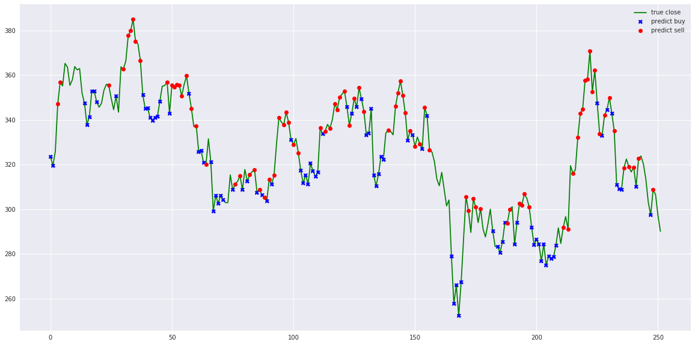

# Stock Prediction Models

---

**Stock Prediction Models** is a collection of machine learning and deep learning models designed for stock forecasting, including trading bots and simulations.

## Table of Contents

  * [Models](#models)
  * [Agents](#agents)
  * [Realtime Agent](realtime-agent)
  * [Data Explorations](#data-explorations)
  * [Simulations](#simulations)
  * [Tensorflow-js](#tensorflow-js)
  * [Miscellaneous](#miscellaneous)
  * [Results](#results)

## Contents

### Models

#### [Deep Learning Models](deep-learning)
 1. LSTM
 2. LSTM Bidirectional
 3. LSTM 2-Path
 4. GRU
 5. GRU Bidirectional
 6. GRU 2-Path
 7. Vanilla
 8. Vanilla Bidirectional
 9. Vanilla 2-Path
 10. LSTM Seq2seq
 11. LSTM Bidirectional Seq2seq
 12. LSTM Seq2seq VAE
 13. GRU Seq2seq
 14. GRU Bidirectional Seq2seq
 15. GRU Seq2seq VAE
 16. Attention-is-all-you-Need
 17. CNN-Seq2seq
 18. Dilated-CNN-Seq2seq

**Bonus**

1. Learn how to forecast `t + N` using one of the models in [how-to-forecast.ipynb](deep-learning/how-to-forecast.ipynb)
2. Explore sentiment-based forecasting with the Consensus model in [sentiment-consensus.ipynb](deep-learning/sentiment-consensus.ipynb)

#### [Stacking Models](stacking)
 1. Deep Feed-forward Auto-Encoder Neural Network
 2. Deep Recurrent Neural Network
 3. ARIMA
 4. Extreme Boosting Gradient Regressor
 5. Adaboost
 6. Bagging
 7. Extra Trees
 8. Gradient Boosting
 9. Random Forest
 10. XGB

### [Agents](agent)

1. Turtle-trading agent
2. Moving-average agent
3. Signal rolling agent
4. Policy-gradient agent
5. Q-learning agent
6. Evolution-strategy agent
7. Double Q-learning agent
8. Recurrent Q-learning agent
9. Double Recurrent Q-learning agent
10. Duel Q-learning agent
11. Double Duel Q-learning agent
12. Duel Recurrent Q-learning agent
13. Double Duel Recurrent Q-learning agent
14. Actor-critic agent
15. Actor-critic Duel agent
16. Actor-critic Recurrent agent
17. Actor-critic Duel Recurrent agent
18. Curiosity Q-learning agent
19. Recurrent Curiosity Q-learning agent
20. Duel Curiosity Q-learning agent
21. Neuro-evolution agent
22. Neuro-evolution with Novelty search agent
23. ABCD strategy agent

### [Data Explorations](misc)

1. Study of the TESLA stock market in [tesla-study.ipynb](misc/tesla-study.ipynb)
2. Outliers study using K-means, SVM, and Gaussian on TESLA stock in [outliers.ipynb](misc/outliers.ipynb)
3. Overbought-Oversold study on TESLA stock in [overbought-oversold.ipynb](misc/overbought-oversold.ipynb)
4. Determine which stocks to buy in [which-stock.ipynb](misc/which-stock.ipynb)

### [Simulations](simulation)

1. Simple Monte Carlo simulation in [monte-carlo-drift.ipynb](simulation/monte-carlo-drift.ipynb)
2. Dynamic volatility Monte Carlo simulation in [monte-carlo-dynamic-volatility.ipynb](simulation/monte-carlo-dynamic-volatility.ipynb)
3. Drift Monte Carlo simulation in [monte-carlo-drift.ipynb](simulation/monte-carlo-drift.ipynb)
4. Multivariate Drift Monte Carlo simulation for BTC/USDT with Bitcurate sentiment in [multivariate-drift-monte-carlo.ipynb](simulation/multivariate-drift-monte-carlo.ipynb)
5. Portfolio optimization inspired by [pythonforfinance.net](https://pythonforfinance.net/2017/01/21/investment-portfolio-optimisation-with-python/) in [portfolio-optimization.ipynb](simulation/portfolio-optimization.ipynb)

### [Tensorflow-js](stock-forecasting-js)

Explore LSTM Recurrent Neural Network and Simple Signal Rolling Agent implemented in Tensorflow JS at [huseinhouse.com/stock-forecasting-js](https://huseinhouse.com/stock-forecasting-js/). You can download historical CSV data and upload it dynamically.

### [Miscellaneous](misc)

1. Predict fashion trends using cross-validation in [fashion-forecasting.ipynb](misc/fashion-forecasting.ipynb)
2. Analyze Bitcoin with LSTM prediction in [bitcoin-analysis-lstm.ipynb](misc/bitcoin-analysis-lstm.ipynb)
3. Learn about Kijang Emas Bank Negara in [kijang-emas-bank-negara.ipynb](misc/kijang-emas-bank-negara.ipynb)

## Results

Explore various results, agents, and simulations for stock prediction and analysis. These include agent performance, signal predictions, analysis of outliers, overbought-oversold studies, and more.

